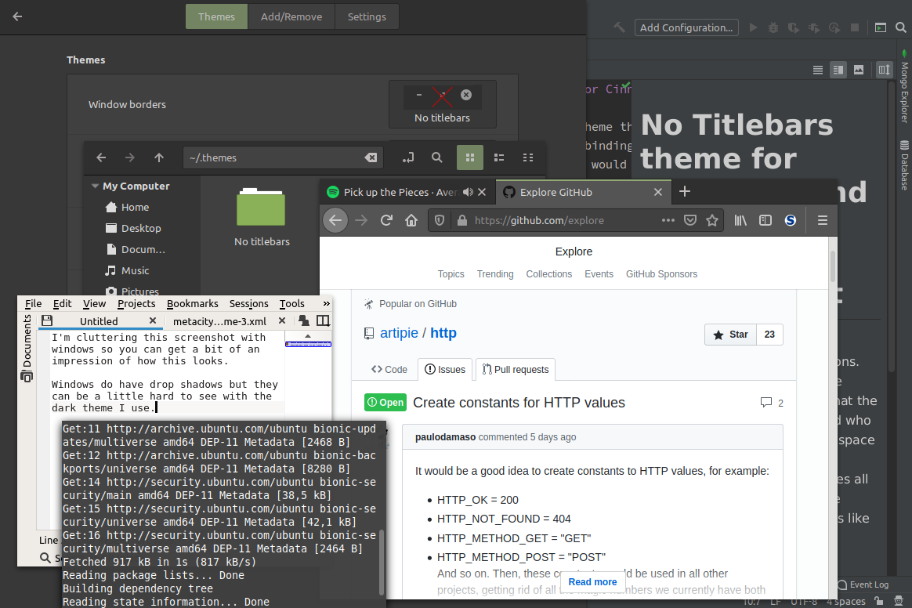

# No Titlebars theme for Cinnamon and the Gnome Desktop Environment 

This is a window border theme for Cinnamon that disables almost all window decorations.
It's intended for people who use keybindings to do everything that the titlebar normally does,
and who would like to regain the screen space lost on window decorations.

Note that this theme removes *all* titlebars.
If you haven't set any keybindings before turning this theme on, you may find it pretty difficult to use your desktop environment.
You will need at least a keybinding for closing windows, one for (un)maximizing windows and one for moving windows around.

This should also work with Gnome desktops, but I have only tried it with Cinnamon so I can't say for sure.
Let me know if it doesn't.

## Installation

[Download this repository as a ZIP](https://github.com/Fruitsalad/No-Titlebars-theme-for-Cinnamon/archive/master.zip),
unpack it and move the “No titlebars” folder into `~/.themes/`.
If you don't have a `.themes` folder in your home directory, you should create it yourself.
You can delete `README.md` and the screenshot, they're only there for the Github page. 

Open up the theme settings for your desktop environment and choose “No titlebars” for window borders.
It should start working immediately after that.

## Related work

If you would rather have it so that only maximized windows have their titlebars removed,
take a look at the Cinnamon extension [Cinnamon Maximus](https://cinnamon-spices.linuxmint.com/extensions/view/73).
